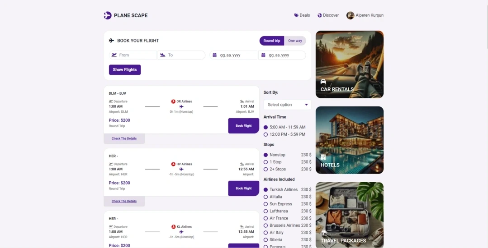

# online-flight-app

HTML - CSS - JS - React - Chakra UI Project

---

# Setting Up and Running a React Project

This guide explains how to set up and run a React project on your local computer, starting from the installation of Node.js.

## Requirements

- Node.js (v16.x or later)
- npm (comes with Node.js)
- Git (Optional, needed if you're pulling the project from a Git repository)

## Steps

### 1. Installing Node.js

You need to have Node.js and npm installed on your system for React projects. Follow these steps to install Node.js:

1. Go to the [Node.js Download Page](https://nodejs.org/en/download/).
2. Download the version suitable for your operating system (prefer the LTS version).
3. Run the downloaded file and follow the instructions to complete the installation.

#### Verifying Node.js Installation

Open the terminal and run the following commands to check the versions:

```bash
node -v
npm -v
```

### 2. Cloning an Existing React Project

If you're cloning an existing project, run the following command in the terminal to clone the repository:

```bash
git clone https://github.com/alperenkursun/online-flight-app.git
cd online-flight-app
```

### 3. Installing Project Dependencies

After creating or cloning the project, you need to install the necessary dependencies by running the following command in the project directory:

```bash
npm install
```

This command will download and install all the required packages into the node_modules folder.

### 4. Running the React Project

Once the dependencies are installed, you can start the project by running:

```bash
npm start
```

This command starts a local development server, usually running the project on http://localhost:3000. You can open this address in your browser to view your application.

### 5. Building for Production

When your app is ready for production, you can create an optimized build by running the following command:

```bash
npm run build
```

This command will generate an optimized and minified build in the build folder.



[See The Project](https://onlineflightapp.netlify.app/)

[Take a look at my website](https://alperenkursun.netlify.app/)
